# PRODIGY_DS_05

## Task 05 - Traffic Accident Data Analysis

This project analyzes US traffic accident data to identify patterns related to road conditions, weather conditions, time of day, and accident hotspots.

## Dataset

Dataset used: US Accidents Dataset  
Source: Kaggle - US Accidents by Sobhan Moosavi

## Objective

- Analyze traffic accident patterns
- Identify accident hotspots
- Study impact of weather conditions
- Analyze accidents by time of day
- Explore road features contributing to accidents
- Visualize important trends and factors

## Technologies Used

- Python
- Pandas
- Matplotlib
- Seaborn
- Folium

## Project Files

```text
PRODIGY_DS_05/
├── traffic_accident_analysis.py
├── summary.txt
├── README.md
├── accident_hotspots_map.html
├── severity_distribution.png
├── accidents_by_hour.png
├── ...
└── wind_speed_distribution.png
```

## Visualizations

### Accident Severity Distribution
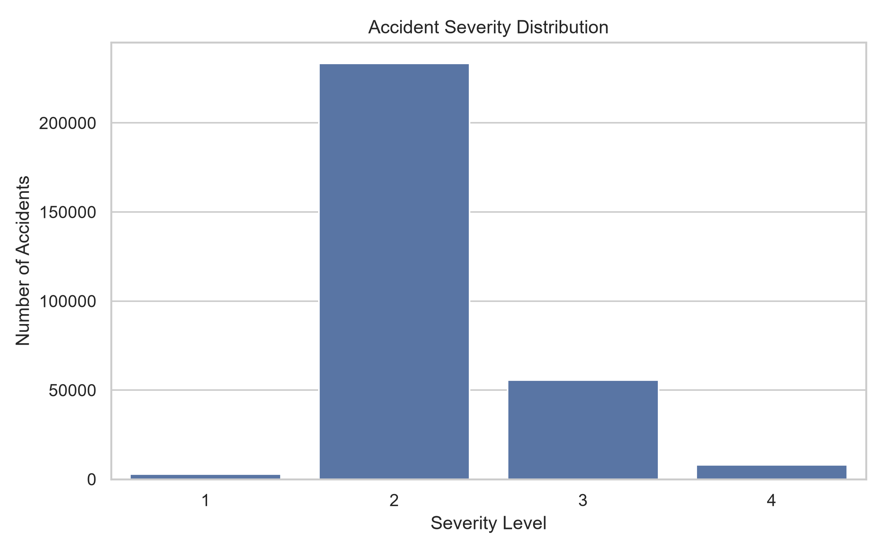

### Accidents by Hour
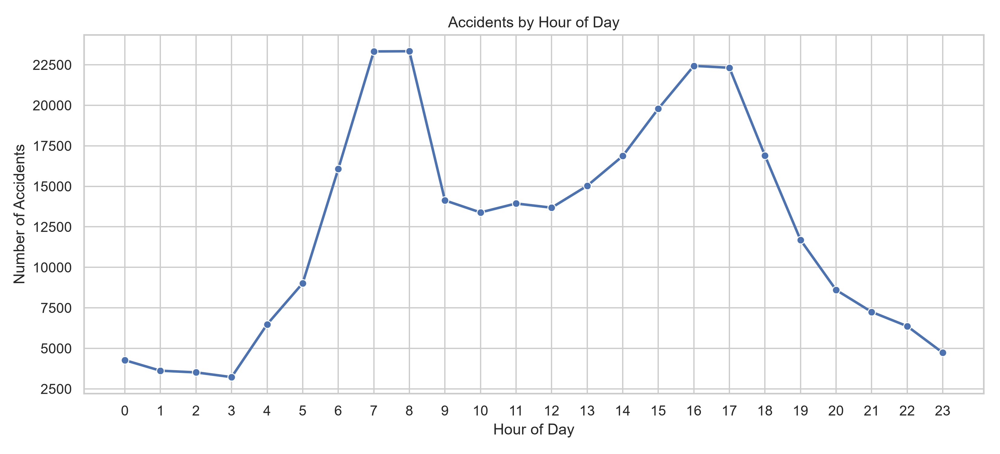

### Accidents by Day
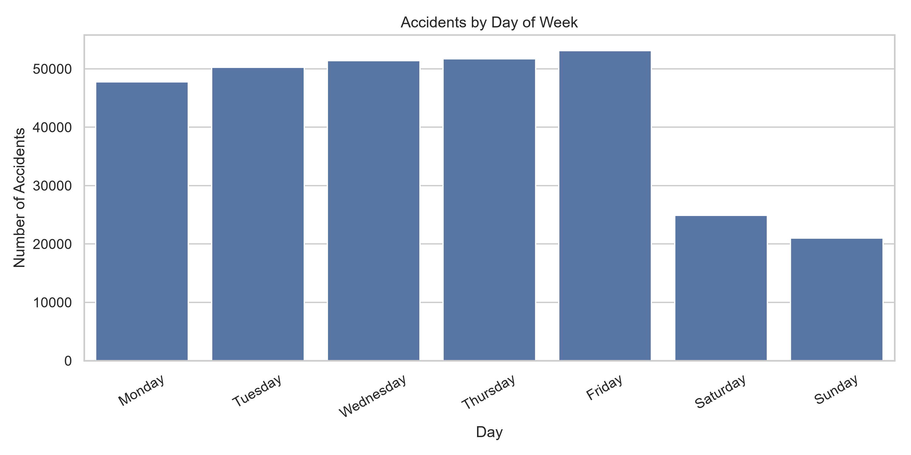

### Top Weather Conditions
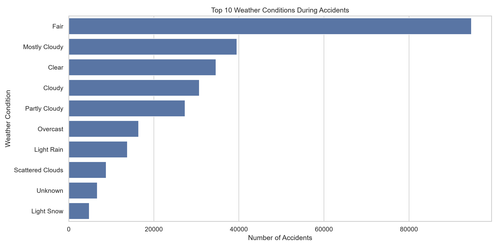

### Top States
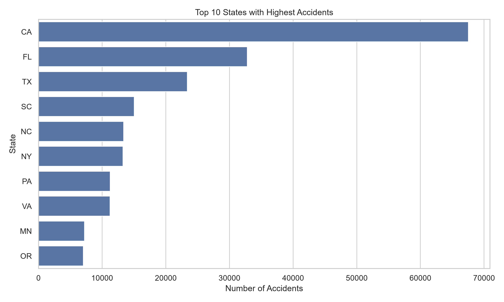

### Top Cities
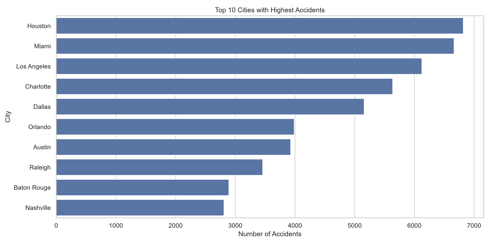

### Road Features
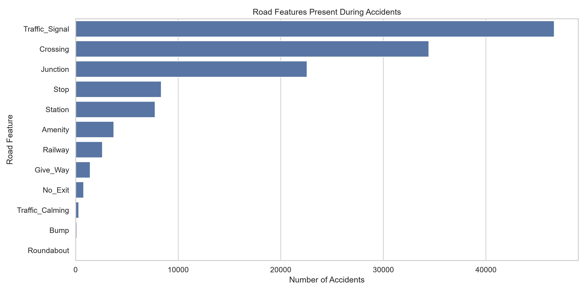

### Day vs Night Accidents
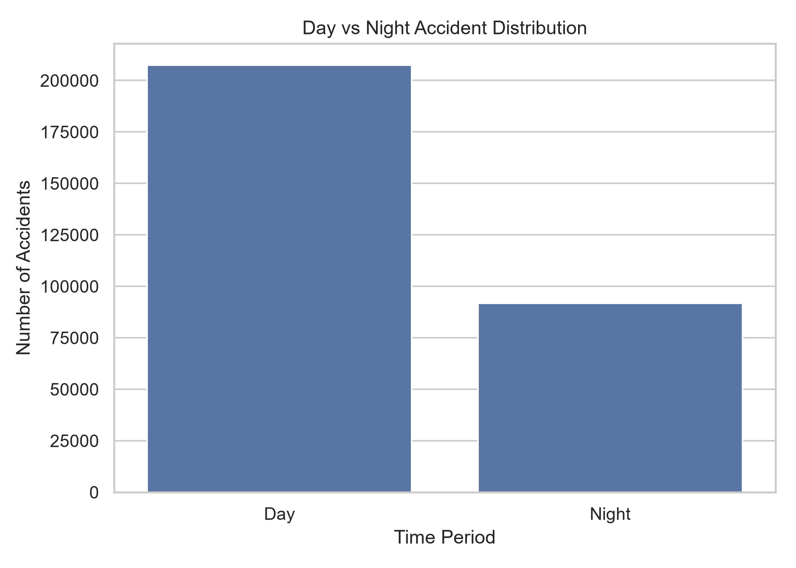

### Monthly Trend
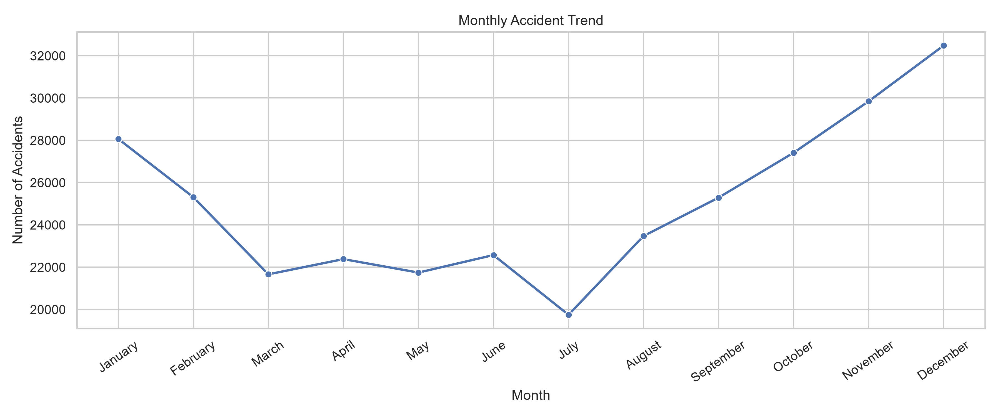

### Severity vs Hour
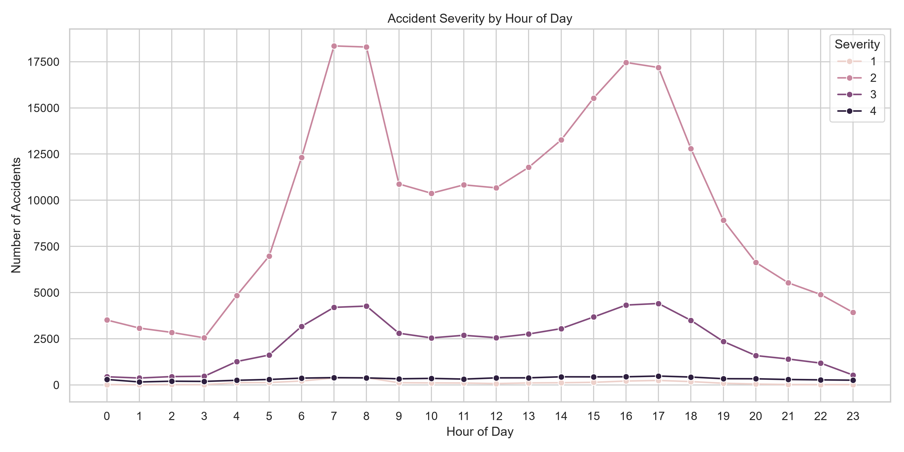

### Temperature Distribution
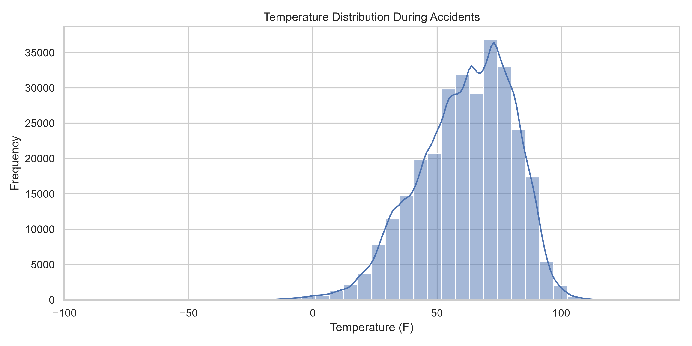

### Visibility Distribution
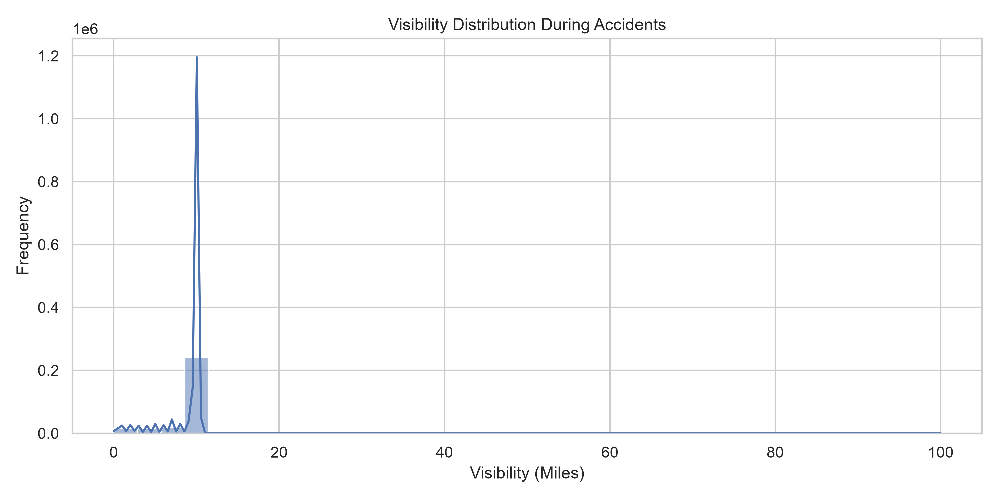

### Wind Speed Distribution
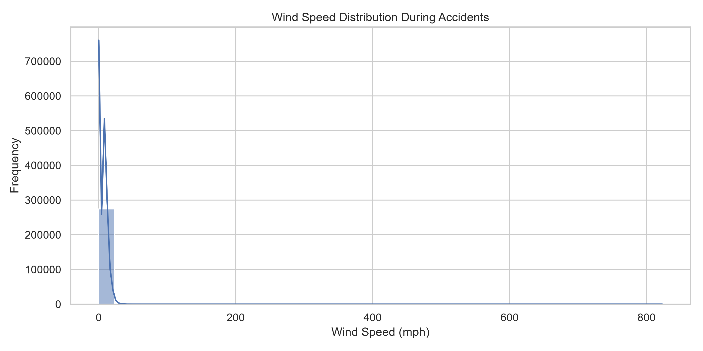

## Accident Hotspot Map

An interactive accident hotspot map is included in this project.

File:
```

accident_hotspots_map.html

```

## Key Findings

- Accident frequency varies significantly with time of day.
- Certain states and cities report higher accident counts.
- Weather conditions influence accident occurrence.
- Road features such as traffic signals, crossings, and junctions contribute to accidents.
- Accident hotspots are visualized using an interactive heatmap.

## How to Run

Install dependencies:

```bash
pip install pandas matplotlib seaborn folium
```

Run the project:

```bash
python traffic_accident_analysis.py
```

## Author

**Krish Kanthariya**
